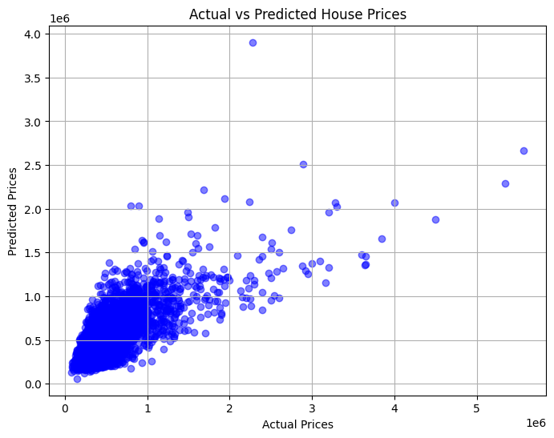

# House Price Prediction using Linear Regression

This project is part of the SkillCraft ML Internship. It predicts house prices based on features such as square footage, number of bedrooms, and bathrooms using a simple linear regression model.

---

## 📁 Dataset

- **Name**: House Sales in King County, USA
- **Source**: [Kaggle Dataset](https://www.kaggle.com/datasets/harlfoxem/housesalesprediction)
- **File Used**: `house_prices.csv`

---

## 📌 Features Used

- `sqft_living`
- `bedrooms`
- `bathrooms`

---

## 🎯 Target Variable

- `price` — the actual selling price of a house.

---

## 🤖 Model Used

- **Model**: Linear Regression
- **Library**: Scikit-learn

---

## 🧪 Evaluation Metrics

- Mean Squared Error (MSE)
- R² Score (R-squared)

---

## 📈 Output Visualization

Scatter plot of Actual vs Predicted house prices:

---

## 🚀 How to Run

1. Open the `house_price_prediction.ipynb` notebook in [Google Colab](https://colab.research.google.com/)
2. Upload the `house_prices.csv` file
3. Run all the cells

---

## 💡 Key Learnings

- How to clean and select features from real-world datasets  
- How to train and test a linear regression model  
- How to evaluate model performance and visualize predictions  

---

## 🛠️ Tools Used

- Python
- Pandas
- Matplotlib
- Scikit-learn
